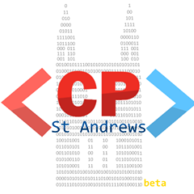

# Competitive Programming St Andrews Beta

This repository contains the resources and questions from past contests, held weekly from 2 PM to 3 PM GMT on HackerRank.

## Sign up for the next contest 

https://www.hackerrank.com/competitive-programming-st-andrews-beta-contest-21

**Important: there is no Contest 19. After last week's Contest 18, we are directly skipping to Contest 20 to correct a historical synchronisation problem.**
## Who are we?

We are a small group of St Andrews students whose main intention is to improve our algorithmic and problem solving skills. This will prepare one for competitive programming competitions as well as help one ace technical coding interviews.

## The contest

It is a weekly programming competition (of approxmately one hour) where you solve fun and interesting programming problems. One of us typically sets the problems for that week.

### Past contests

They can be found [here](/Competitions). Analysis, and in some cases, solutions and editorials can be found there. If not here, they can be found on the contest page itself (under the "Editorial" section), where test cases can also be downloaded.

### Past winners

The leaderboard for each contest can be found on the contest page itself.

## Follow us

Facebook: https://www.facebook.com/CompetitiveProgrammingStAndrews/

Linkedin: https://www.linkedin.com/company/competitive-programming-st-andrews/

